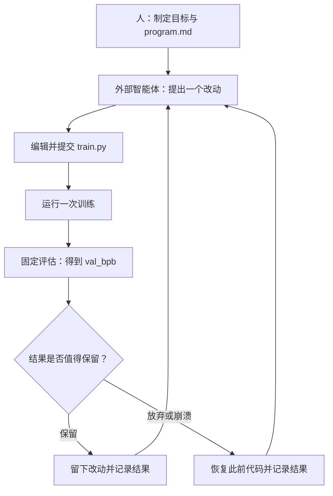
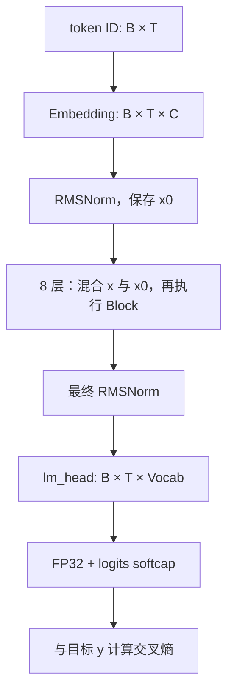

# autoresearch 中文学习教程：从 Python 到 Transformer，再到自动实验

[返回项目说明](../README.md) · [自动实验协议](../program.md) · [结果分析 Notebook](../analysis.ipynb)

**适合你目前的基础：会 Python，希望系统学习 Transformer 和自动实验流程。**

本教程以本地提交 `228791fb499afffb54b46200aca536f79142f117` 的代码为依据，编写于 2026-09-16。源码行号以该版本为准，后续修改后请优先按函数名定位。这里分别说明“代码已实现的事实”“帮助理解的简化示例”和“建议开展的实验”；示例分数不代表本机训练结果。

完成后，你应该能够：

1. 从文本一路解释到 token、注意力、预测概率、损失和参数更新。
2. 看懂 `prepare.py` 与 `train.py` 的数据流，算清默认模型维度和批大小。
3. 独立建立基线、提出改动、读取结果并作出保留或放弃的判断。
4. 理解 `program.md` 如何把工作交给外部 AI 智能体，以及它的评估边界。

本次只进行了文档整理、源码核对和教学示例验证，没有安装项目依赖、下载训练数据或启动 GPU 训练。

## 目录

- [0. 建议的学习路线](#route)
- [1. 项目到底在研究什么](#overview)
- [2. 从 Python 补齐深度学习基础](#basics)
- [3. 你的环境与实践准备](#environment)
- [4. 数据如何变成训练样本](#data)
- [5. 从零理解 Transformer](#transformer)
- [6. 对照源码拆解这个 GPT](#model)
- [7. 梯度、AdamW 与 Muon](#optimizer)
- [8. 训练循环与 5 分钟预算](#training)
- [9. 读懂 BPB 和实验报告](#evaluation)
- [10. 完成第一组手动实验](#experiments)
- [11. 将实验交给 AI 智能体](#agent)
- [12. 分析实验结果](#analysis)
- [13. 常见问题与源码阅读陷阱](#pitfalls)
- [14. 自测题与参考答案](#exercises)
- [15. 术语表与进阶阅读](#references)

<a id="route"></a>

## 0. 建议的学习路线

可以分成 7 次学习，每次约 60～90 分钟。这是阅读与练习时间的建议，不包含环境安装、数据下载和训练等待。

| 次数 | 阅读范围 | 动手任务 | 学完后应能回答 |
|---|---|---|---|
| 1 | 第 1～2 节 | 运行“损失与梯度”小实验 | 神经网络究竟在优化什么？ |
| 2 | 第 4 节 | 手工构造输入与目标的错位序列 | 为什么每行准备 `T+1` 个 token？ |
| 3 | 第 5 节 | 运行纯 Python 注意力实验 | 为什么并行训练不会看到未来？ |
| 4 | 第 6～7 节 | 标出各张量形状与参数组 | 这个 GPT 增加了哪些结构？ |
| 5 | 第 3、8～9 节 | 检查环境，理解训练日志 | 时间预算和 BPB 分别衡量什么？ |
| 6 | 第 10 节 | 环境可用后做基线和单因素改动 | 如何判断实验是否值得保留？ |
| 7 | 第 11～14 节 | 分析结果，设计有限实验 | 怎样把研究步骤变成执行协议？ |

第一次阅读先跳过 Muon 的矩阵多项式细节。先讲清“数据 → 模型 → 损失 → 梯度 → 更新 → 评估”，再理解性能优化。第 2、5、9 节的纯 Python 小实验不依赖 GPU，也不依赖项目安装。

推荐源码阅读顺序：

```text
README.md
  → prepare.py 的常量和 evaluate_bpb
  → train.py 的超参数与 build_model_config
  → GPT.forward → Block → CausalSelfAttention → MLP
  → train.py 的训练循环
  → prepare.py 的 make_dataloader
  → GPT.setup_optimizer → MuonAdamW
  → program.md → analysis.ipynb
```

<a id="overview"></a>

## 1. 项目到底在研究什么

### 1.1 两个模型、两层循环

| 角色 | 做什么 | 位于哪里 |
|---|---|---|
| 外部 AI 智能体 | 阅读代码、提出改动、运行命令、比较实验 | 由你另行启动的编码智能体提供 |
| 被训练的小 GPT | 根据前面的 token 预测下一个 token | `train.py` 中的 `GPT` |

`uv run train.py` 只运行一次小 GPT 的训练和评估。它不会自动启动编码智能体，也不会自行修改代码。



外层循环搜索**训练方案**；内层循环用梯度更新**模型参数**。

每次启动 `train.py` 都重新设随机种子、创建模型、初始化权重。连续保留的实验累积的是代码改进，并不是沿用上一轮训练好的权重。当前脚本没有保存 checkpoint，也没有现成的聊天、采样或部署入口。

### 1.2 要优化什么

可以把目标写成：

$$
\min_c\ \mathrm{BPB}\bigl(\mathrm{Train}(c,\ \text{固定训练预算})\bigr)
$$

方案 `c` 包含模型大小、架构、学习率和批大小等。大模型也许表达能力更强，但单步更慢；小模型可能在相同时间内看见更多 token。项目通过实验寻找二者的合适平衡。

“模型更大”“每步 loss 更低”“吞吐更高”都不能独立推出最终结果更好，最终要看固定条件下的 `val_bpb`。

### 1.3 文件地图

| 文件 | 职责 | 学习重点 |
|---|---|---|
| [prepare.py](../prepare.py) | 下载、分词器、加载、固定评估 | 数据和“裁判”的定义 |
| [train.py](../train.py) | GPT、优化器、训练循环 | 可改动的实验主体 |
| [program.md](../program.md) | 智能体实验协议 | 范围、记录与决策 |
| [pyproject.toml](../pyproject.toml) | 依赖声明 | `torch==2.9.1`，CUDA 12.8 wheel 源 |
| [uv.lock](../uv.lock) | 锁定的依赖解析 | 复现实验环境 |
| [.python-version](../.python-version) | 项目 Python 版本 | 当前为 `3.10` |
| [analysis.ipynb](../analysis.ipynb) | 读取 TSV、统计、绘图 | 哪些改动有效 |
| `results.tsv` | 运行时的实验记录 | 由实验流程创建，当前不自带真实结果 |
| [progress.png](../progress.png) | 仓库提供的进展示意 | 不代表本机实验结果 |

<a id="basics"></a>

## 2. 从 Python 补齐深度学习基础

### 2.1 张量是带形状的数值数组

| 符号 | 含义 | 本项目默认训练值 |
|---|---|---|
| `B` | 一次微批次的序列条数 | 128 |
| `T` | 每条序列的 token 数 | 2048 |
| `C` | token 隐藏向量的维度 | 512 |
| `H` | 注意力头数 | 4 |
| `Vocab` | 词表大小 | 分词器目标为 8192 |

输入 token ID 是整数数组 `[B,T]`。Embedding 查表得到浮点数组 `[B,T,C]`。最后给词表中每个候选 token 打分，得到 `[B,T,Vocab]`。

token ID 只是索引。ID 200 不是 ID 100 的两倍语义；可学习的含义来自对应向量。

### 2.2 从分数到概率，再到损失

模型输出的原始分数叫 logits。softmax 将一个位置的分数转换为概率：

$$
p_j=\frac{e^{z_j}}{\sum_k e^{z_k}}
$$

正确目标为 `y` 时，交叉熵损失为：

$$
L=-\ln p_y
$$

正确答案概率为 0.9 时损失约 0.105；概率为 0.1 时损失约 2.303。预测越有把握且越正确，损失越低。

`F.cross_entropy` 直接接收 logits，内部完成相应计算，传入前不用再做 softmax。训练用默认的均值归约；评估用 `reduction="none"` 保留逐 token 损失。API 依据：[PyTorch 2.9 cross_entropy 文档](https://docs.pytorch.org/docs/2.9/generated/torch.nn.functional.cross_entropy.html)。

### 2.3 梯度告诉参数往哪里移动

把全部可训练数值记作 `θ`。梯度 `∂L/∂θ` 描述参数微小变化时，损失如何变化。最简单的更新方式为：

$$
\theta \leftarrow \theta-\eta\nabla_\theta L
$$

`η` 是学习率。反向传播利用链式法则，把最终损失的影响逐层传回参数。PyTorch 自动记录计算过程，`loss.backward()` 负责计算梯度；优化器的 `step()` 才真正修改参数。

先理解“算损失 → 找降低损失的方向 → 小步更新”，再补链式法则。

### 2.4 小实验 A：不用 PyTorch，也能看见学习

把三个 logits 直接当参数，反复提高正确类别 2 的概率。它演示 softmax、交叉熵和梯度下降，不是完整语言模型。将代码单独保存为 Python 文件，用普通 `python` 运行：

```python
# demo: softmax_learning（只依赖 Python 标准库）
import math

def softmax(values):
    maximum = max(values)
    exps = [math.exp(v - maximum) for v in values]
    total = sum(exps)
    return [v / total for v in exps]

logits = [0.0, 0.0, 0.0]
target = 2
learning_rate = 0.5

for step in range(21):
    probabilities = softmax(logits)
    loss = -math.log(probabilities[target])
    if step in (0, 1, 5, 20):
        print(step, round(loss, 4), round(probabilities[target], 4))
    if step < 20:
        # 对 logits 的梯度：预测概率减去正确类别的 one-hot
        gradient = [
            p - float(i == target)
            for i, p in enumerate(probabilities)
        ]
        logits = [
            z - learning_rate * g
            for z, g in zip(logits, gradient)
        ]
```

第 0 步三个类别等概率，正确类别概率为 `1/3`，损失约 `1.0986`。随后损失应下降、正确类别概率应上升。减去最大分数不改变 softmax，只是避免指数溢出。

### 2.5 认识这些 PyTorch 写法

| 写法 | 初步理解 |
|---|---|
| `nn.Module` | 带参数、可调用的计算模块 |
| `nn.Parameter` | 注册为可训练参数的张量 |
| `nn.Embedding(V, C)` | `V` 行、每行 `C` 个数的可学习查找表 |
| `nn.Linear(C, D, bias=False)` | 最后一维从 `C` 到 `D` 的线性映射 |
| `view(B, T, H, d)` | 元素总数不变，重新解释形状 |
| `register_buffer` | 随模型管理，但不作为可训练参数 |
| `torch.no_grad()` | 不构建反向传播图 |
| `model.eval()` | 切换评估行为；本身不等于关闭梯度 |
| `detach()` | 与梯度图脱离，用于记录等操作 |
| `zero_grad(set_to_none=True)` | 清除上一轮累积的参数梯度 |

<a id="environment"></a>

## 3. 你的环境与实践准备

### 3.1 本次实际检查结果

这是一份 2026-09-16 的本机状态记录，后续安装软件后会变化。

| 项目 | 检查结果 |
|---|---|
| 系统与 Shell | Windows / PowerShell |
| GPU | NVIDIA GeForce RTX 4090 D |
| 显存 | `nvidia-smi` 报告 24564 MiB，约 24 GiB |
| CUDA compute capability | 8.9 |
| uv | 已安装，版本 0.11.18 |
| 当前默认 Python | 3.13.5，与项目的版本选择不同 |
| 项目 `.venv` | 当前不存在 |
| 当前默认 Python 的 torch | 未安装 |
| `~/.cache/autoresearch/` | 当前不存在 |

有 NVIDIA GPU 只是必要条件之一。`train.py` 在模块顶层加载外部 Flash Attention 内核，然后使用 CUDA、BF16 和 `torch.compile`。尚未在本机验证完整训练链路，不能仅根据显卡型号承诺运行成功。

原生 Windows 下，PyTorch 能使用 GPU，也不自动代表外部内核和编译链兼容。若遇到这类问题，可考虑在独立的 Linux／WSL2 环境验证；NVIDIA 提供了 [CUDA on WSL 官方说明](https://docs.nvidia.com/cuda/wsl-user-guide/index.html)。这是环境路线建议，不是本仓库在 WSL2 上已通过验证的结论。

### 3.2 先验证依赖，再下载数据

以下命令供后续实践使用；本次未执行安装和训练。所有项目命令从中文版目录 `autoresearch-zh-CN/` 运行。它是 `aL0ng-z/autoresearch` 的普通子目录，Git 根目录位于上一级；分支和提交属于整个仓库。在中文版目录执行 `git add train.py` 时，操作的是其中的中文版训练文件。

uv 已安装时不用重装。其他设备可查 [uv 官方安装文档](https://docs.astral.sh/uv/getting-started/installation/)；Windows 使用其中的 PowerShell 方式，不能直接把 `curl ... | sh` 当作 PowerShell 命令。

```powershell
# 优先按现有锁文件安装
uv sync --locked

# 确认项目实际使用的解释器
uv run python --version

# 查看 PyTorch 与 CUDA 是否可用
uv run python -c "import torch; print(torch.__version__); print(torch.version.cuda); print(torch.cuda.is_available())"
```

`uv sync --locked` 检查锁文件与项目声明的一致性；不一致时先查原因。uv 的项目环境通常位于 `.venv`，不等同于全局或 Conda Python。依据：[uv 锁定与同步说明](https://docs.astral.sh/uv/concepts/projects/sync/)。

CUDA 可用后，再执行：

```powershell
uv run python -c "import torch; print(torch.cuda.get_device_name(0)); print(torch.cuda.get_device_capability(0))"

# 对应 train.py 顶层逻辑；首次可能下载内核
uv run python -c "import torch; from kernels import get_kernel; cap=torch.cuda.get_device_capability(); repo='varunneal/flash-attention-3' if cap==(9,0) else 'kernels-community/flash-attn3'; kernel=get_kernel(repo); print(repo); print(kernel.flash_attn_interface)"
```

最后一条只验证导入和接口存在，不能代替前向、反向和编译测试。你的 GPU 能力值为 8.9，因此按本地代码会选择 `kernels-community/flash-attn3`。

**外部依赖提示（2026-09-16）：**维护方公告称，自 2026-09-13 起会移除旧的 model 类型内核仓库，并要求使用新版 `kernels`。这可能影响旧环境的下载或加载，是否受影响需实际验证。保留错误信息，在独立环境适配后重新建立基线。公告见[维护方说明](https://huggingface.co/kernels-community/flash-attn3/blob/main/README.md)。本教程没有改动依赖来绕过它。

### 3.3 准备数据和分词器

```powershell
# 默认 10 个训练分片，加固定验证分片，再训练分词器
uv run prepare.py
```

成功后会出现：

```text
.cache/autoresearch/
├── data/
│   ├── shard_00000.parquet
│   ├── ...
│   ├── shard_00009.parquet
│   └── shard_06542.parquet
└── tokenizer/
    ├── tokenizer.pkl
    └── token_bytes.pt
```

当前 Windows 用户对应 `C:\Users\DTRC-ZXL\.cache\autoresearch\`；切换到 WSL 后则使用 Linux 用户的家目录，缓存不会自动共用。

`uv run prepare.py --num-shards 2` 可以减少首次准备规模，但仍额外下载验证分片、仍训练分词器，单个分片也不保证很小。不同数据缓存条件的成绩不应混在同一对照中。

下载器跳过已有分片，两个分词器文件同时存在时也跳过重新训练。**`--num-shards 2` 不会删除之前下载的更多分片；训练加载器会使用缓存中的所有训练分片。** 比较实验前应记录实际缓存内容。

### 3.4 24 GB 显存如何开始

默认 `DEVICE_BATCH_SIZE=128` 没有在本机验证。仅默认形状的 FP32 logits 就占：

$$
128\times2048\times8192\times4\ \text{字节}=8\ \text{GiB}
$$

反向传播、其他激活、临时张量和优化器还需要显存，因此“约 5033 万参数”并不意味着默认训练很省显存。

内核兼容且数据就绪后，可先在学习分支把 `DEVICE_BATCH_SIZE` 降到 8，其他配置保持不变。这是待验证的起点，不是显存保证。此时：

```text
微批次 token 数 = 8 × 2048 = 16384
每次更新的累积次数 = 524288 / 16384 = 32
```

若仍然 OOM，再单独考虑降低 `DEPTH`。原始配置无法运行时，应记录失败，再把“适合本机且稳定运行的配置”定义为本机基线；不要标成未改动的上游基线。

<a id="data"></a>

## 4. 数据如何变成训练样本

对应 [prepare.py](../prepare.py) 的 `download_data`、`train_tokenizer`、`Tokenizer` 和 `make_dataloader`。

### 4.1 训练集和验证集在哪里分开

默认下载编号 0～9 的训练分片，加固定验证分片 `shard_06542.parquet`。分词器训练的 `text_iterator` 与模型训练的 `_document_batches("train")` 都排除验证分片。

验证数据不直接用于模型训练。但外层反复依据同一验证集选择方案，仍可能产生选择偏差，详见第 11 节。

### 4.2 BPE 是什么

字节对编码（Byte Pair Encoding，BPE）逐步合并常见的相邻单元，使常见片段用较少 token 表示。token 可以是词、部分词、标点或字节片段，不等于一个汉字或英文单词。

本项目依次：

1. 用正则表达式预切分文本。
2. 用 `rustbpe` 训练合并规则，目标总词表大小为 8192。
3. 预留 4 个特殊 token，其中 `<|reserved_0|>` 作为 BOS。
4. 转换为 `tiktoken.Encoding`，保存为 `tokenizer.pkl`。
5. 建立 `token_bytes.pt`，供评估查找各 token 的字节计数。

分词器训练默认最多累计约 10 亿字符，每篇最多取前 10000 字符，最后一篇可能使累计值略超上限。这是**训练分词器的语料迭代设置**，不要误认为模型训练加载器也在同一位置截断文档。

词表大小决定“有哪些符号可预测”；隐藏维度决定“每个符号用多长的向量表示”。

### 4.3 为什么输入和标签只差一位

```text
完整行：[BOS, 我, 喜欢, 学习, 。]
输入 x：[BOS, 我, 喜欢, 学习]
目标 y：[我, 喜欢, 学习, 。]
```

这里只用文字表示 token 的位置关系，不声称实际分词器按这种方式切分。

位置 0 根据 BOS 预测“我”；位置 1 根据 BOS 和“我”预测“喜欢”。因此得到长度 `T` 的输入和目标，必须先准备 `T+1` 个 token。源码对应：

```python
# 源码摘录：row_buffer 形状为 [B, T+1]
cpu_inputs.copy_(row_buffer[:, :-1])
cpu_targets.copy_(row_buffer[:, 1:])
```

### 4.4 best-fit packing 如何装箱

数据加载器维护一个文档缓冲区，每篇已加 BOS。填每行时，选择能完整放入剩余空间的最长文档；都放不下时，就取最短文档的前一段填满。

例如剩余容量 7，候选长度为 3、5、9，先选 5；剩 2，再裁剪最短文档填满。

由此得到：

- 每行以 BOS 开头，但行内可能有多个 BOS。
- 不使用 padding，位置利用率为 100%。
- 被裁掉的文档尾部不会自动留到下一行。
- 没有额外的文档间隔离掩码，同一行后面的文档可注意到前面的文档。

`_document_batches` 按排序后的文件遍历，读完再循环；没有每个 epoch 随机打乱文件的步骤。

### 4.5 缓冲区为什么值得注意

代码预分配 CPU/GPU 缓冲区，使用锁页内存及 `non_blocking=True` 复制，以减少重复分配等开销。返回的输入和目标会复用 GPU 存储。

调试时若要长期保留多批样本，应复制数据，不能把同一缓冲区的连续视图当作独立快照。训练在消费当前批次后才获取下一批。

**练习：**手工写一个长度 6 的完整 token 行，得到长度 5 的 `x` 和 `y`，检查 `y[t]` 是否始终等于完整行的下一项。


<a id="transformer"></a>

## 5. 从零理解 Transformer

### 5.1 Embedding：把编号变成向量

`nn.Embedding(Vocab, C)` 是一张可学习的表。输入 `[B,T]` 中的每个整数选出一行长度为 `C` 的向量，输出 `[B,T,C]`。

同一 token 查表时得到相同向量；经过注意力层后，它会根据上下文得到不同的表示。

### 5.2 注意力：从哪些位置获取信息

对输入做三种线性映射：

- **Q（Query，查询）**：当前位置想寻找什么信息。
- **K（Key，键）**：各位置提供怎样的匹配特征。
- **V（Value，值）**：匹配后实际汇集的信息，别与词表大小 `Vocab` 混淆。

基础的缩放点积注意力为：

$$
\operatorname{Attention}(Q,K,V)
=\operatorname{softmax}\left(\frac{QK^\top}{\sqrt{d}}+M\right)V
$$

先用 Q/K 点积算相关程度，再归一化为权重，最后对 Value 加权求和。`M` 是掩码，禁止位置设为负无穷，其 softmax 权重便为 0。公式来源：[Transformer 原论文](https://arxiv.org/html/1706.03762v7#S3.SS2.SSS1)。本项目还在 Q/K 上应用 RoPE 和 RMSNorm，并用 Flash Attention 内核计算。

### 5.3 因果掩码：不能偷看未来

对 4 个输入位置，允许访问的矩阵如下，1 表示允许：

```text
        可读取的位置
        0  1  2  3
位置 0  1  0  0  0
位置 1  1  1  0  0
位置 2  1  1  1  0
位置 3  1  1  1  1
```

位置 `t` 可以读 `x[t]`，因为预测的是错后一位的 `y[t]`。训练时整条序列已准备好，可以并行计算所有位置；掩码让各位置仍遵守自回归条件。

生成时下一项尚未知，通常逐项生成并追加上下文。本项目没有将生成过程封装成现成接口。

### 5.4 小实验 B：纯 Python 单头因果注意力

直接给定 Q、K、Value，省略学习投影、RoPE、多头和梯度，仅验证注意力计算：

```python
# demo: causal_attention（只依赖 Python 标准库）
import math

def softmax(values):
    maximum = max(values)
    exps = [math.exp(x - maximum) for x in values]
    total = sum(exps)
    return [x / total for x in exps]

q = [[1.0, 0.0], [0.0, 1.0], [1.0, 1.0]]
k = [[1.0, 0.0], [0.0, 1.0], [1.0, 1.0]]
values = [[10.0, 0.0], [0.0, 10.0], [5.0, 5.0]]
head_dim = len(q[0])

for i, query in enumerate(q):
    scores = []
    for j, key in enumerate(k):
        score = sum(a * b for a, b in zip(query, key))
        scores.append(score / math.sqrt(head_dim) if j <= i else -math.inf)
    weights = softmax(scores)
    output = [
        sum(weights[j] * values[j][d] for j in range(len(values)))
        for d in range(len(values[0]))
    ]
    assert abs(sum(weights) - 1.0) < 1e-12
    assert all(weights[j] == 0 for j in range(i + 1, len(weights)))
    print(i, [round(w, 4) for w in weights],
          [round(v, 4) for v in output])
```

预期输出：

```text
0 [1.0, 0.0, 0.0] [10.0, 0.0]
1 [0.3302, 0.6698, 0.0] [3.3024, 6.6976]
2 [0.2483, 0.2483, 0.5035] [5.0, 5.0]
```

把最后一个 Value 改成很大的数：前两个位置的输出应不变。这是直接检查因果性的办法。

### 5.5 多头和位置编码

多头让不同投影子空间并行匹配信息。默认 512 通道分为 4 头，每头 128 维。不能预先保证某一头负责语法或某种语义，它们的功能由训练形成。

本项目用 **RoPE（旋转位置编码）**，按位置对 Q/K 的通道对旋转，让相对位置进入注意力计算。它没有把绝对位置向量表直接加到 token embedding 上。概念来源：[RoFormer 论文](https://arxiv.org/abs/2104.09864)。

### 5.6 MLP、残差、归一化

注意力跨位置汇集信息；MLP 在每个位置变换通道。本项目使用：

$$
\mathrm{MLP}(x)=W_2\left(\mathrm{ReLU}(W_1x)^2\right)
$$

维度为 `C → 4C → C`，激活是 ReLU 的平方，不是常见示例中的 GELU。

残差 `x+f(x)` 在原有表示上学习增量。RMSNorm 用均方根缩放向量，帮助控制数值尺度；本项目的 `norm` 没有额外传入可学习缩放权重。实际 Block 是：

```python
# 源码摘录：Pre-Norm 残差结构
x = x + self.attn(norm(x), ve, cos_sin, window_size)
x = x + self.mlp(norm(x))
```

<a id="model"></a>

## 6. 对照源码拆解这个 GPT

### 6.1 读实际构造配置，不只读类默认值

`GPTConfig` 类默认写着 12 层、768 维、32768 词表，但训练用 `build_model_config(DEPTH)` 覆盖它们，并读取实际分词器词表。

| 项目 | 推导 | 实际默认值 |
|---|---|---|
| 深度 | `DEPTH` | 8 |
| 初始宽度 | `DEPTH × ASPECT_RATIO` | `8 × 64 = 512` |
| 隐藏维度 | 向上取整到 `HEAD_DIM` 的整数倍 | 512 |
| 头数 | `512 / 128` | 4 |
| KV 头数 | 当前等于 Q 头数 | 4 |
| 序列长度 | `MAX_SEQ_LEN` | 2048 |
| 词表 | `tokenizer.get_vocab_size()` | 正常准备时目标 8192 |
| 窗口模式 | `WINDOW_PATTERN` | `SSSL` |

默认并未使用较少 KV 头的 GQA，尽管注意力类的维度检查为此留出了空间。

### 6.2 按数据流阅读 GPT.forward



源码索引（均在 [train.py](../train.py)）：

| 行号 | 符号 | 阅读目标 |
|---|---|---|
| 32～58 | `GPTConfig`、`norm`、`apply_rotary_emb` | 配置、归一化、旋转 |
| 61～96 | `CausalSelfAttention` | Q/K/V、值嵌入、内核 |
| 99～121 | `MLP`、`Block` | 单层计算 |
| 124～206 | `GPT.__init__`、`init_weights`、窗口 | 参数、初始化 |
| 236～266 | `setup_optimizer` | 参数分组 |
| 268～291 | `GPT.forward` | 完整前向 |
| 433～477 | 超参数、`build_model_config` | 实际配置 |
| 543～630 | 训练、评估、打印 | 实验结果如何形成 |

### 6.3 张量形状核对

| 张量或操作 | 符号形状 | 默认微批次形状 |
|---|---|---|
| `idx` / `targets` | `[B,T]` | `[128,2048]` |
| token embedding | `[B,T,C]` | `[128,2048,512]` |
| `q,k,v` | `[B,T,H,d]` | `[128,2048,4,128]` |
| 拼接各头 | `[B,T,C]` | `[128,2048,512]` |
| MLP 中间张量 | `[B,T,4C]` | `[128,2048,2048]` |
| logits | `[B,T,Vocab]` | `[128,2048,8192]` |
| 扁平 logits | `[B×T,Vocab]` | `[262144,8192]` |
| 扁平目标 | `[B×T]` | `[262144]` |

Flash Attention 避免普通实现中完整物化所有注意力中间矩阵的方式，但不会消除 logits、MLP 激活等显存需求。

### 6.4 本项目的额外结构

**局部与完整窗口。** `S` 的窗口参数为 `(1024,0)`，`L` 为 `(2048,0)`，同时启用 `causal=True`。8 层为 `S,S,S,L,S,S,S,L`，最后一层强制为完整窗口。`S` 表示约半个上下文的左侧窗口；精确端点由内核约定。

**Value Embedding。** 索引 1、3、5、7 的层额外查一张值嵌入表，再经输入相关门控加到 V 上。门控读取输入前 32 通道，计算 `2 × sigmoid(...)`，每个 KV 头一个门值。值嵌入是可学习参数，不是生成时缓存旧 K/V 的 KV cache。

**跨层混合初始表示。** 每个 Block 前执行：

$$
x\leftarrow\lambda_i^{\mathrm{resid}}x+\lambda_i^{x0}x_0
$$

`x0` 是最初归一化后的 embedding。实际 `init_weights` 将两组标量分别设为 1 和 0.1，不能只看构造函数中的暂时全零值。

**输出软限制。** logits 转为 FP32 后执行：

$$
z\leftarrow15\tanh(z/15)
$$

这会平滑限制分数幅度，不是硬截断。

**初始化与权重。** 注意力输出投影和 MLP 输出投影初始化为零；输入 embedding 与输出 `lm_head` 没有权重共享。模型先在 `meta` 设备建立结构，再 `to_empty` 分配至 GPU，然后显式初始化。

### 6.5 默认参数量推导

词表 8192、8 层、宽度 512、4 头时：

| 部分 | 参数量 |
|---|---:|
| 输入 embedding | 4,194,304 |
| 4 张 Value Embedding | 16,777,216 |
| 输出 `lm_head` | 4,194,304 |
| 8 层注意力与 MLP，包括值门控 | 25,166,336 |
| 两组层间标量 | 16 |
| **合计** | **50,332,176** |

这是按源码形状计算，没有运行 GPU。删除值嵌入会显著改变参数量，因此不只是“删除一个没有成本的小技巧”。

<a id="optimizer"></a>

## 7. 梯度、AdamW 与 Muon

### 7.1 参数如何分组

`MuonAdamW` 通过参数组的 `kind` 分派；不能仅按张量是否二维判断。

| 参数 | 优化器分支 | 初始学习率设置 |
|---|---|---|
| 输入 embedding、Value Embedding | AdamW | `EMBEDDING_LR` 乘宽度缩放 |
| 输出 `lm_head` | AdamW | `UNEMBEDDING_LR` 乘宽度缩放 |
| `resid_lambdas` | AdamW | `SCALAR_LR × 0.01` |
| `x0_lambdas` | AdamW | `SCALAR_LR`，单独的 beta1 |
| Block 的矩阵，包括值门控 | Muon | `MATRIX_LR`，另有矩阵形状缩放 |

Embedding、`lm_head` 也是二维矩阵，却明确使用 AdamW；以 `setup_optimizer` 为准。

### 7.2 AdamW 分支

Adam 类方法累计梯度的一阶和二阶统计量，近似理解为“方向的平滑估计”和“各参数梯度尺度的估计”，再校正并更新。

代码实现了独立的权重衰减，但当前 AdamW 参数组均设置 `weight_decay=0`。全局 `WEIGHT_DECAY=0.2` 不作用于所有参数。

### 7.3 Muon 分支

相同形状的矩阵被分组、堆叠，更新大致分五步：

1. 动量平滑梯度方向。
2. 用代码中的 Polar Express 多项式迭代近似正交化更新方向。
3. 用代码标为 NorMuon 的二阶统计量调整尺度。
4. 在 `g * parameter >= 0` 的位置应用条件权重衰减。
5. 更新后复制回各参数。

这是对本地实现的概括，不是“让网络权重始终正交”，也不是直接调用一个标准 PyTorch 优化器。先能在 `muon_step_fused` 指出五个阶段，再深入矩阵极分解与多项式近似。

### 7.4 配置值不总是实际学习率

Embedding 和输出矩阵的学习率乘以：

$$
s=(C/768)^{-1/2}
$$

`C=512` 时 `s≈1.2247`，输入 embedding 初始学习率约 `0.6×1.2247≈0.7348`。层间标量没有这项缩放。

Muon 还按形状乘以 `max(1, 行数/列数)^{1/2}`；每步又有学习率乘数 `lrm`。要区分超参数常量、参数组初始值和当步实际更新尺度。

<a id="training"></a>

## 8. 训练循环与 5 分钟预算

### 8.1 梯度累积

```text
DEVICE_BATCH_SIZE = 128 条序列
MAX_SEQ_LEN       = 2048 token / 序列
TOTAL_BATCH_SIZE  = 2**19 = 524288 token / 参数更新

tokens_per_fwdbwd = 128 × 2048 = 262144
grad_accum_steps  = 524288 / 262144 = 2
```

一次更新的简化流程：

```python
# 教学伪代码：省略计时、调度、性能处理
for micro_step in range(grad_accum_steps):
    loss = model(x, y)
    (loss / grad_accum_steps).backward()
    x, y, epoch = next(train_loader)

optimizer.step()
model.zero_grad(set_to_none=True)
```

梯度会累积，所以把各微批次的平均 loss 除以累积次数，得到总批次的平均梯度；这里依赖各微批次 token 数相同。

源码要求：

$$
\mathrm{TOTAL\_BATCH\_SIZE}\bmod
(\mathrm{DEVICE\_BATCH\_SIZE}\times\mathrm{MAX\_SEQ\_LEN})=0
$$

`TOTAL_BATCH_SIZE` 单位是 token，不是序列。不能任意改成不满足整除关系的组合。

### 8.2 哪些时间进入预算

`step > 10` 意味着编号 0～10 共 11 次更新不计入 `total_training_time`，但仍真实更新权重。这样近似避开初始编译和预热。

此后单步计时大致涵盖前向、反向、下一批准备、更新及 CUDA 同步。步骤之外的日志和部分其他开销不在该累计值内。完成当前步骤后检查是否达到 300 秒，因此可能稍微超出。

| 指标／概念 | 含义 |
|---|---|
| `training_seconds` | 按上述规则累计的训练步骤时间 |
| `total_seconds` | 从设置阶段 `t_start` 到评估结束的时间 |
| Shell 看到的完整耗时 | 还可能包含 `uv`、Python 启动，以及 `t_start` 之前的导入与内核加载 |

“排除编译”是跳过若干初始步骤的近似，不是精确识别每段编译耗时。通过增加不计时训练、规避计时或改变评估得到的分数不构成公平改进。

### 8.3 调度由时间进度驱动

$$
p=\min(\mathrm{total\_training\_time}/300,\ 1)
$$

默认 `WARMUP_RATIO=0`、`WARMDOWN_RATIO=0.5`、`FINAL_LR_FRAC=0`：

- 前半段计时时间，学习率乘数为 1。
- 后半段线性降向 0。
- 更新使用此前累计时间，停止前不一定实际执行过乘数恰为 0 的更新。

不同设备在 300 秒内完成的步数不同，按时间调度与预算相匹配。

例外是 `get_muon_momentum(step)`：它按步数从 0.85 在约 300 步内升到 0.95。Muon 权重衰减则按时间设置为 `WEIGHT_DECAY × (1-p)`。

### 8.4 混合精度、编译、日志

前向和损失在 CUDA BF16 autocast 中运行，反向在上下文外调用。autocast 按算子选择精度，不代表所有张量一律 BF16；代码显式把 logits 转成 FP32。参考 [PyTorch 2.9 混合精度文档](https://docs.pytorch.org/docs/2.9/amp.html)。

模型和优化器更新函数用 `torch.compile`，所以首次运行可能较慢，形状变化也可能触发重新编译。

| 日志字段 | 含义 |
|---|---|
| `loss` | 经过指数滑动平均与偏差校正；原始记录取每次更新最后一个微批次的 loss |
| `lrm` | 参数组初始学习率的乘数 |
| `dt` | 本次更新步骤耗时 |
| `tok/sec` | `TOTAL_BATCH_SIZE / dt` |
| `epoch` | 文档迭代器的轮次；有缓冲、裁剪，不等于每个 token 都整齐地训练了一遍 |
| `remaining` | 剩余计时预算 |

训练 loss 为 NaN 或大于 100 时打印 `FAIL` 并退出。训练结束后才计算最终 `val_bpb`，不会每步都评估验证集。


<a id="evaluation"></a>

## 9. 读懂 BPB 和实验报告

### 9.1 为什么不用训练 loss 直接评选

训练 loss 衡量当前训练样本的拟合情况，不等于未训练文本上的表现。它通常按 token 平均，但不同分词器把相同文本切成不同数量的 token，所以每 token loss 也不适合无条件跨词表比较。

**BPB（bits per byte，每字节比特数）**把预测的负对数概率按字节归一化：

$$
\mathrm{BPB}
=
\frac{\sum_{i:\,b_i>0}-\ln p(y_i\mid x_{\leq i})}
{\ln 2\cdot\sum_i b_i}
$$

`b_i` 来自该项目的 `token_bytes` 查表。自然对数的单位是 nat，除以 `ln 2` 转成 bit。直观上，越能预测文本，就越能用较少的信息量描述它；这是信息量指标，不是实际运行一个压缩程序。

这里的字节计数按 `prepare.py` 对单个 token 解码再 UTF-8 编码的查表逻辑定义，不能换成字符数。严格跨分词器比较还应核对单 token 解码、字节计数、文本与上下文等条件；“按字节归一化”不是消除所有实验差异的保证。

### 9.2 小实验 C：手算 BPB

设三个目标 token 的正确概率为 0.5、0.25、0.125，对应字节数为 2、1、0。第三个是本例中的特殊 token，必须从损失和字节总数中同时排除。

```python
# demo: bpb_metric（只依赖 Python 标准库）
import math

target_probabilities = [0.5, 0.25, 0.125]
token_bytes = [2, 1, 0]

total_nats = sum(
    -math.log(p)
    for p, nbytes in zip(target_probabilities, token_bytes)
    if nbytes > 0
)
total_bytes = sum(token_bytes)
bpb = total_nats / (math.log(2) * total_bytes)

assert math.isclose(bpb, 1.0)
print(f"BPB = {bpb:.6f}")
```

前两个 token 分别需要 1 bit 和 2 bit，总计 3 bit；除以 3 byte，得到 `1.000000` BPB。

不能把崩溃记录的 `0.000000` 当成最优分数：它只是 `program.md` 规定的占位，必须结合 `status=crash` 排除。

### 9.3 evaluate_bpb 实际做什么

对应 [prepare.py](../prepare.py) 第 343～365 行：

1. 从 GPU 加载字节查表。
2. 创建验证加载器，固定序列长度 `MAX_SEQ_LEN=2048`。
3. 计算评估批次数 `EVAL_TOKENS // (batch_size * MAX_SEQ_LEN)`。
4. 取得逐 token 交叉熵，排除字节数为 0 的目标。
5. 分别累计有效损失、字节数，最后求比值。

`EVAL_TOKENS=40×524288=20,971,520`，默认 `B=128` 时评估 80 批。`B=8` 时评估 1280 批，总目标 token 数仍相同。若批大小不能整除预算，代码用向下取整的批数，实际评估 token 数会小于常量。

默认训练 loss 不排除 BOS，因为数据中没有把它改成 `-1`；评估则通过零字节掩码排除特殊目标。它们不是完全相同的平均方式。

### 9.4 输出汇总怎么读

| 字段 | 含义与限制 |
|---|---|
| `val_bpb` | 主要比较指标，越低越好 |
| `training_seconds` | 代码累计的训练步骤耗时 |
| `total_seconds` | 脚本设置阶段至评估结束的耗时 |
| `peak_vram_mb` | PyTorch 记录的峰值已分配显存，实际按 MiB 计算 |
| `mfu_percent` | 估算的计算利用率，以硬编码的 H100 BF16 峰值为分母 |
| `total_tokens_M` | 参数更新次数乘总批次 token 数，单位百万，包含不计时预热步骤 |
| `num_steps` | 已完成的参数更新次数 |
| `num_params_M` | 参数数量，单位百万 |
| `depth` | Transformer 层数 |

这台 RTX 4090 D 上的 `mfu_percent` **不能直接当作该卡的真实峰值利用率**。源码还用 `step-10` 估算稳态步数，与计时跳过 11 步存在一个步骤的差别；把它当粗略辅助量即可。

`peak_vram_mb` 包含截至最终评估时记录到的峰值，不等于 `nvidia-smi` 中整个进程或整张卡的全部占用。结果表将它除以 1024 得到的量更准确地说是 GiB，字段名仍按原协议保留 `memory_gb`。

<a id="experiments"></a>

## 10. 完成第一组手动实验

### 10.1 先把问题写成可检验的假设

一个可用的实验描述包括：

> 当前基线的矩阵学习率为 0.04。我怀疑学习率偏大；只将 `MATRIX_LR` 改为 0.02，其他条件保持一致。观察 `val_bpb` 是否下降，同时记录吞吐、步数和显存。若仅一次微小下降，先重复验证。

“同时改深度、窗口、学习率，看看是否更好”可以用于探索，但不适合初学阶段判断各因素的作用。

### 10.2 建立学习分支和基线

先保存现有文档工作、检查工作区，再建立一个尚不存在的学习分支。以下命令不会由教程自动执行：

```powershell
git status --short
git switch -c learning/first-experiments
```

如果该名字已存在，另取一个新名字。默认配置不能适配显存时，按第 3 节确定本机基线，把调整原因写入记录，然后只提交实验代码：

```powershell
git diff -- train.py
git add train.py
git commit -m "Define local training baseline"
git rev-parse --short=7 HEAD
```

如果 `train.py` 完全未改动，就无需为它创建空提交，直接记录当前提交。

运行一次并保留日志：

```powershell
uv run train.py > baseline.log 2>&1

# 命令结束后立刻检查退出码
$LASTEXITCODE

# 提取指标
Select-String -Path baseline.log -Pattern '^val_bpb:','^peak_vram_mb:','^training_seconds:','^num_steps:'

# 出错时查看末尾
Get-Content -LiteralPath baseline.log -Tail 50
```

Bash 环境的等价提取方式：

```bash
grep -E '^val_bpb:|^peak_vram_mb:|^training_seconds:|^num_steps:' baseline.log
tail -n 50 baseline.log
```

成功基线应有正常退出、有限数值的 `val_bpb` 和完整汇总。只看到训练 loss 下降，不代表验证已成功。

### 10.3 正确写 TSV

项目脚本**只打印结果**，不会自动写 `results.tsv`。这一工作属于人或外部智能体。

下面可在中文版目录 `autoresearch-zh-CN/`、项目 Python 环境中运行，初始化一次表头。若已存在文件，会拒绝覆盖：

```python
# 实践步骤：执行后会创建 results.tsv，不属于免安装演示
import csv
from pathlib import Path

path = Path("results.tsv")
with path.open("x", encoding="utf-8", newline="") as f:
    writer = csv.writer(f, delimiter="\t")
    writer.writerow(["commit", "val_bpb", "memory_gb", "status", "description"])
```

后续每轮按同样五列追加真实记录，使用真实制表符。不能把文档里用于展示的两个字符 `\` 和 `t` 原样当分隔符。`csv.writer(..., delimiter="\t")` 可以避免这个问题。

记录规则：

- 基线成功后记为 `keep`，描述注明它是原始基线还是本机适配基线。
- 成功但未保留的实验记 `discard`，保留真实指标。
- 崩溃记 `crash`，数值按协议用 0 占位，描述写明原因。
- 提交哈希对应**本次实际执行的代码**；应在回退前记录。
- `results.tsv` 已在 `.gitignore` 中，默认不提交。日志和额外记录可放在被忽略的 `results/` 目录；目录需自行创建。

### 10.4 第一组实验建议

这是学习用的候选设计，**没有预先测得改善**。先从同一基线分别比较，避免早期混入累计改动。

| 编号 | 只改哪一项 | 对照值 → 候选值 | 要观察什么 |
|---|---|---|---|
| B0 | 不改 | 当前可运行基线 | 参考分数与波动 |
| E1 | `MATRIX_LR` | 0.04 → 0.02 | 较小更新是否提升验证表现 |
| E2 | `WARMDOWN_RATIO` | 0.5 → 0.25 | 更晚开始降学习率的影响 |
| E3 | `WINDOW_PATTERN` | `SSSL` → `L` | 更长注意范围的收益是否抵消速度代价 |

若你的基线已修改这些值，需相应调整对照。每轮先写假设，修改一项，审查 diff，提交，运行，记录，再判断。

初学时可以用每个候选独立分支的方式保存历史；不要把“不保留”理解为必须立即销毁失败记录。原协议的自动循环采用保留／重置策略，核心是下一次必须从明确的参考状态开始。

### 10.5 多小的改善才值得相信

固定种子有助于控制差异，但时间预算下步数仍可能因编译、机器负载和吞吐波动变化。第一次出现微小改善，只能称为候选结果。

建议对值得保留的方案及基线各重复约 3 次，比较均值和波动，再考虑更多随机种子。若改变种子，应同时检查源码中的 CPU 与 CUDA 种子设置。少量重复不等于严谨统计显著性，但比只看单次最小值更可靠。

本轮的简短记录可以写成：

```text
研究问题：
参考提交与候选提交：
唯一改动：
固定条件：GPU / 依赖 / 数据分片 / tokenizer / 评估 / 时间预算
基线与候选的各次 val_bpb：
训练步数与峰值显存：
结论：保留 / 放弃 / 需要重复
下一步：
```

<a id="agent"></a>

## 11. 将实验交给 AI 智能体

### 11.1 program.md 是研究协议，不是启动脚本

`program.md` 规定读取哪些文件、哪些内容可改、如何提交和评估、如何记录、何时回退。执行者是外部编码智能体。

Python 代码不会解析这个 Markdown 来实现约束。因此“不要改评估”和“不要增加依赖”仍需通过 diff、日志和人工审查核对，不能认为有一份提示词就获得了程序级强制隔离。

三种职责：

| 职责 | 当前对应位置 |
|---|---|
| 研究方向、判断标准 | 人与 `program.md` |
| 提出与执行候选方案 | 外部智能体 |
| 固定数据与评价标准 | `prepare.py` |

### 11.2 从有限轮数开始学习

原协议在初始设置确认后要求持续运行。你在学习阶段可以明确给出有限的任务范围，例如：

```text
请先阅读 README.md、program.md、prepare.py 和 train.py。
这次是教学实验：完成基线和至多 3 个候选实验后停止并总结。

保持 prepare.py、依赖和评估方式不变。
候选方案每次只引入一个主要改动。
每次运行前写出假设，完成后记录提交、指标、显存和保留理由。
若原始配置因环境或显存问题无法运行，先记录原因，
明确建立本机基线，再开始候选比较。
结束时说明哪些结果已重复验证、哪些仍只是单次观察。
```

有限轮数来自你这次具体任务的范围；它和原始“持续运行”协议的用途不同。理解流程之后再扩大自动实验规模。

### 11.3 保持实验有效的几条原则

首先，研究者不能通过改“裁判”降低分数。修改验证集、减少评估范围、改变字节计数、让验证数据参与训练或绕开时间预算，都使结果失去原来的对照意义。

其次，在固定验证集上反复试方案会带来选择偏差。若将结果用于正式研究，宜在独立研究分支加入未参与方案选择的最终测试集、更多种子和更长预算检验。那是新的研究设计，不能偷偷改动当前固定评估。

最后，较低 BPB 说明当前分布上的下一 token 预测更好，不自动代表聊天、推理或你的科研领域任务更好。把评价指标与真实用途联系起来，是人需要承担的研究判断。

标准实验中的硬条件包括文件修改范围、依赖、评估和计时；显存与复杂度是选择时的代价因素。协议里“同分则放弃”和“明显简化可保留”有一个例外关系，应明确记录理由。

<a id="analysis"></a>

## 12. 分析实验结果

### 12.1 如何打开 Notebook

在具备 Notebook 支持的编辑器或 Jupyter 环境中打开 [analysis.ipynb](../analysis.ipynb)，选择安装了项目依赖的 Python 解释器，并把工作目录设为中文版目录 `autoresearch-zh-CN/`。

项目依赖包含 pandas、NumPy 和 Matplotlib，但没有声明完整的 Jupyter／ipykernel 开发工具链。若编辑器要求额外安装，可把阅读分析所需工具放在单独的分析环境；不要在标准自动实验中悄悄添加训练依赖。没有 Notebook 环境时，也可先只阅读代码单元。

中文 Notebook 已翻译说明、注释和图表文字，并设置常用中文字体候选；系统仍需存在相应字体。英文原版位于 [analysis.en.ipynb](../analysis.en.ipynb)。

### 12.2 各部分回答什么问题

| 部分 | 回答的问题 |
|---|---|
| 载入 TSV、规范状态 | 数据能否正确读取？ |
| `KEEP/DISCARD/CRASH` 统计 | 成功、失败和保留各占多少？ |
| 所有保留记录 | 哪些代码改动留下了？ |
| BPB 随实验推进的图 | 目前最好成绩何时改善？ |
| 汇总统计 | 基线与最好结果差多少？ |
| 改善幅度排序 | 哪一步的边际收益最大？ |

保留率分母是 `keep + discard`，不包含 `crash`；基线若标记 `keep` 也计入其中，不能把这个数简单解释为“智能体提出新想法的成功概率”。

### 12.3 读图时不要漏掉筛选逻辑

原分析逻辑有几个具体假设：

- 第一条记录是有效基线，且至少有一条 `keep`。
- 崩溃记录在绘图前移除，横轴随后重新编号。
- 散点只显示不高于基线加 0.0005 的结果；较差的实验并非没有发生。
- 最佳阶梯线对保留记录取累计最小值。
- 当只有基线、或者最好值恰等于基线时，纵轴上下限可能相同，Matplotlib 会自动扩展并可能提示。
- 保存图片会覆盖当前目录的 `progress.png`。如需保留仓库示意图，应先在分析副本中改保存文件名。

因此，仅看图不能完整判断失败率；要一起看 TSV 和统计。

改善幅度定义为前一次保留的 BPB 减去当前保留的 BPB。如果各轮从前一次保留状态继续修改，这表示累计搜索中的边际收益。它不等于把全部候选都从共同基线独立训练后的因果贡献，更不代表权重连续训练。

<a id="pitfalls"></a>

## 13. 常见问题与源码阅读陷阱

| 现象／误解 | 先查什么 |
|---|---|
| `uv sync` 成功，但训练失败 | CUDA、外部内核、`flash_attn_interface` 与编译链分别检查 |
| 系统 `python` 有包，`uv run` 里没有 | 它们可能是不同解释器，检查项目 `.venv` |
| 找不到 `tokenizer.pkl` | 是否在同一用户、同一系统环境执行过 `prepare.py` |
| 数据下载报告结束但训练缺文件 | 检查实际成功分片数；下载函数会汇总失败，不应只看最后一句 |
| OOM | 先看微批次、序列长度、logits/激活，再看深度；不能只看参数量 |
| batch 断言失败 | 总 token 批次是否被 `B×T` 整除 |
| 已超过 5 分钟仍未结束 | 首次编译、不计时初始步骤、最终评估和加载开销 |
| loss 好看但 val_bpb 更差 | 训练拟合和验证表现不同，检查实验是否过拟合或不稳定 |
| 最小 BPB 是 0 | 先排除 `status=crash` 的占位分数 |
| Notebook 报文件不存在 | 尚未生成真实 `results.tsv`，或工作目录不对 |
| 图里实验数与横轴不一致 | 横轴移除了崩溃，散点还筛选了较差结果 |
| `DEPTH=4` 却不是原宽度一半的任意变体 | 宽度、头数、值嵌入层也随深度和取整规则变化 |
| 想 `from train import GPT` 做小练习 | 当前模块顶层会查 GPU、加载内核并开始训练；不能当纯定义库随便导入 |

最后一条尤其重要。阅读模型可以查看源码；写独立教学模型时应在单独文件中提取所需结构并明确简化，不要为了看类定义而直接导入整个训练脚本。

<a id="exercises"></a>

## 14. 自测题与参考答案

先独立回答，再看答案。

1. 为什么输入长度为 `T`，准备数据却要 `T+1`？
2. `B=16`、`T=2048`、总批次 `2**19` 时累积多少次？
3. 把 `DEPTH` 从 8 改为 6，默认宽度和头数变成多少？
4. 为什么降低训练 loss 不一定降低验证 BPB？
5. BPB 公式为什么除以 `ln 2`？BOS 为什么不计字节？
6. 模型中哪些二维参数没有使用 Muon？
7. Value Embedding 和 KV cache 有什么区别？
8. 固定种子为什么不能保证时间预算实验每次完全一样？
9. 若每轮保留代码，下一轮是在已有模型权重上继续训练吗？
10. 将 `TIME_BUDGET` 改为 600 后分数变好，能否算作标准协议下的改进？
11. 为什么 `mfu_percent` 不适合作为 4090 D 的准确硬件利用率？
12. 只有一条崩溃记录时，为什么不该直接运行原版分析图？

**参考答案：**

1. 需要用 `[:-1]` 和 `[1:]` 构造相差一个 token 的输入和目标。
2. `524288 / (16×2048) = 16` 次。
3. `6×64=384`，已经是 128 的倍数，因此宽度 384、3 个头。
4. 训练与验证数据不同；训练 loss 与 BPB 的归约方式也不同，前者改善不保证后者改善。
5. 自然对数单位是 nat，除 `ln 2` 转为 bit；该协议将特殊 token 的字节长度定义为 0，评估同时排除其损失。
6. 输入 embedding、Value Embedding、输出 `lm_head` 都是二维，但被分到 AdamW。
7. 前者是训练得到的额外查表参数；后者通常是生成过程中缓存先前位置的 K/V 计算结果。
8. 机器负载、编译和吞吐波动可能改变预算内步数；硬件算子也不因设种子就必然完全确定。
9. 不是，每轮重新初始化；累积的是训练代码改动。
10. 不能，增加训练预算改变了比较条件，而且违反 `prepare.py` 固定的协议。
11. 分母硬编码为 H100 的峰值，且计算量与稳态步数本身也是估计。
12. 崩溃占位不能当有效 BPB，且图表假定存在有效基线和保留记录。

**结课练习：**用自己的话写一页说明，串起“原始文本 → token → 错位目标 → 因果注意力 → loss → 梯度 → 参数更新 → BPB → 保留／放弃”。如果能明确指出每一步所在的函数，就已具备独立读懂这个项目的基础。

<a id="references"></a>

## 15. 术语表与进阶阅读

### 15.1 术语速查

| 英文 | 中文与本项目含义 |
|---|---|
| token / tokenizer | 文本离散单元／分词器 |
| embedding | 将 ID 映射为可学习向量的查表 |
| autoregressive | 自回归，根据前面内容预测下一项 |
| causal mask | 因果掩码，禁止访问未来位置 |
| attention head | 在一个投影子空间进行注意力计算的头 |
| logits | softmax 之前的原始分数 |
| cross-entropy | 交叉熵，正确目标概率的负对数 |
| backpropagation | 反向传播，计算损失对参数的梯度 |
| microbatch | 微批次，一次前向／反向处理的数据 |
| gradient accumulation | 梯度累积，多次微批次后更新一次 |
| warmup / warmdown | 学习率升温／降温；不要和编译预热混淆 |
| checkpoint | 模型与可能的优化器状态快照，本脚本未保存 |
| baseline / ablation | 基线／消融，用受控改变分析组成部分的作用 |
| BPB | 每字节比特数，当前核心验证指标 |
| OOM | 显存或内存不足，本项目常见于 GPU |
| MFU | 模型 FLOPs 利用率，本项目给出硬件基准相关的估算 |
| keep / discard / crash | 保留／放弃／崩溃，记录字段保留英文 |

### 15.2 按问题阅读，而不是一次读完所有论文

| 想解决的问题 | 推荐阅读位置 |
|---|---|
| 不清楚数据和评价边界 | 回读本地 `prepare.py` 的 `text_iterator`、`make_dataloader`、`evaluate_bpb` |
| 不清楚注意力公式 | [Transformer 原论文第 3.2 节](https://arxiv.org/html/1706.03762v7#S3.SS2)，配合第 5 节小实验 |
| 不清楚位置如何进入 Q/K | [RoFormer 原论文](https://arxiv.org/abs/2104.09864)，对照 `apply_rotary_emb` |
| 不清楚 loss 的输入和归约 | [PyTorch 2.9 cross_entropy](https://docs.pytorch.org/docs/2.9/generated/torch.nn.functional.cross_entropy.html) |
| 不清楚 BF16 上下文 | [PyTorch 2.9 AMP](https://docs.pytorch.org/docs/2.9/amp.html)，对照训练循环 |
| 不清楚依赖和解释器 | [uv 锁定与同步文档](https://docs.astral.sh/uv/concepts/projects/sync/) |
| 想深入矩阵优化器 | 先逐行读本地 `setup_optimizer`、`_step_muon`、`muon_step_fused`，再研究其矩阵运算 |

第一阶段的完成标准是能解释数据流并做一个可靠的单因素实验。之后再尝试模型消融、多种子验证、独立测试集和更长训练预算，以检验短时搜索发现能否推广。
